# 🧠 Trajectory 基於腦年齡與失智症預測模型之長期腦部健康追蹤系統

> **開發團隊**： [顏少于](https://github.com/ShyShyFaceElephant)、[王冠智](https://github.com/simonwanggggggg)、[徐睿淳](https://github.com/1leo23)

> **技術支援**： 劉學諺

---

## 👀 系統簡介

[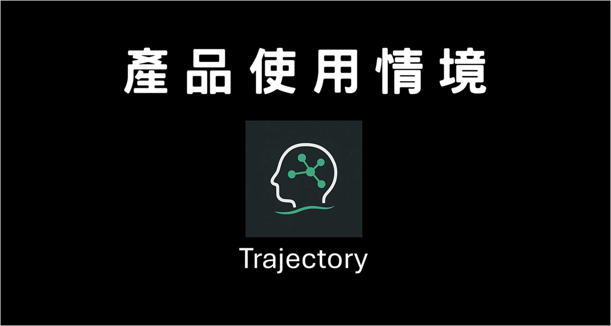](https://youtu.be/BqUar3XKf_s?si=NuUovgDhDbl5ky7P)

> 產品介紹影片：https://youtu.be/BqUar3XKf_s?si=NuUovgDhDbl5ky7P

Trajectory是一套基於**腦年齡與失智症預測模型**的長期腦部健康追蹤系統，旨在滿足高齡化與少子化社會對精準醫療的需求。受試者之**腦部 MRI**影像輸入至本系統後，腦齡預測模型會提供腦齡值作為腦部健康狀態的量化指標。本系統適用於所有年齡層，不僅可作為兒童與青少年腦部成熟度的評估工具，亦能作為中老年族群認知退化的早期徵兆。

我們將本系統命名為「Trajectory」，意為「軌跡」。它不僅是單純的腦齡預測模型之圖形化介面，更是一個包含**長期腦齡追蹤**、**AI失智症輔助診斷**與**關鍵腦區熱圖**的完整系統。本系統透過折線圖呈現歷次腦齡紀錄，追蹤個人成長軌跡。一般使用者可調閱歷次 MRI 影像紀錄，並查看其分析結果（包括腦齡、AI 失智症診斷與關鍵腦區熱圖）；醫師則具有上傳、編輯與查看患者資料等更高層次的管理者權限。

---

## 🏥 應用場景

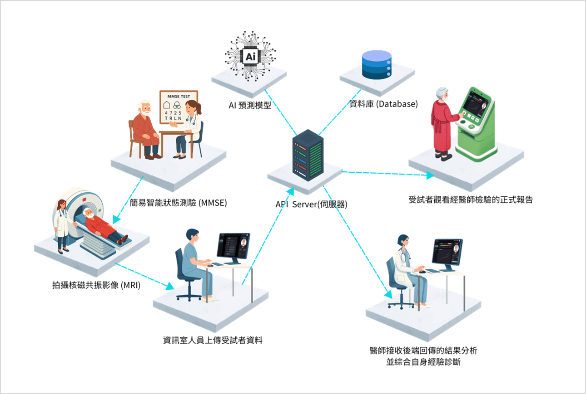
> 圖1. Trajectory系統應用場景

本系統使用流程如下：

1. 受試者進行簡易智能狀態測驗（MMSE）（中低年齡群體不需參與）
2. 受試者拍攝腦部MRI影像
3. 資訊室人員將腦部MRI影像及認知測驗結果上傳至伺服器
4. 伺服器運行腦齡預測模型與失智症診斷模型
5. 伺服器將分析結果（包含：腦齡、AI失智症診斷、關鍵腦區熱圖）歸檔
6. 醫師調用受試者資料並結合自身專業知識做出最終診斷
7. 受試者在院內機台也可調閱分析結果與診斷紀錄

---

## ⛓️ 系統架構

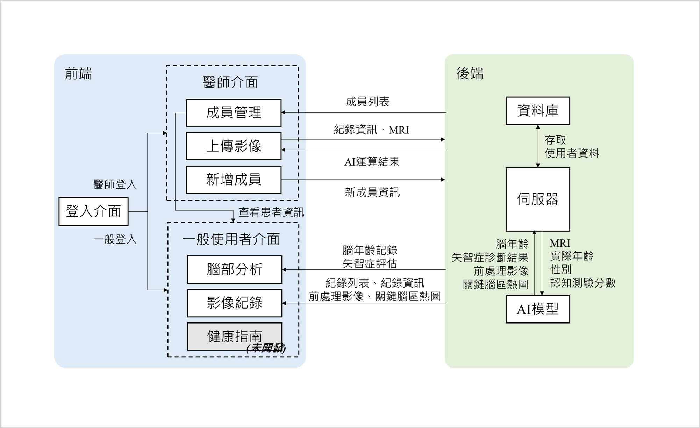
> 圖2. Trajectory系統架構

本系統採**前後端完全分離**設計，目的是讓使用者在不同終端設備皆能使用相同API存取資料。

本系統欲在醫院中多種終端設備部屬，因此採用跨平台前端框架，考量到 MRI 影像涉及大量數據傳輸與顯示，故在我們多種跨平台前端框架中，選擇存取速度與偵率表現更卓越的Flutter。前端分為醫師介面與一般使用者介面，一般使用者介面提供使用者查閱歷次影像紀錄與腦部分析結果；醫師介面則提供管理者上傳影像、執行AI運算功能，並統一管理受試者。

由於本系統的 AI 模型以 Python 撰寫，為提升運算效率並簡化跨語言介面維護，我們選擇以同樣基於 Python 的 FastAPI 作為後端框架。後端由伺服器負責接受API請求，並溝通資料庫及AI模型模組，彼此獨立運行，確保系統安全穩定。

順帶一提，本系統除了提供使用者查看診斷結果外，希望能納入「健康指南」給予具體的治療或保健方針，但本團隊受限於專業知識，此功能暫時留在藍圖中。

---

## 🤖 AI運算模組

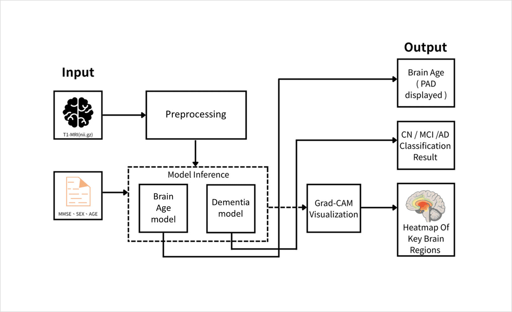
> 圖3. Trajectory AI運算模組

圖3為本系統後端的AI運算模組之架構。首先，腦部 MRI 影像會經過前處理，處理後的影像隨後會被送入兩個平行的運算流程 (腦齡預測、失智症預測) 。

最後，利用**Grad-CAM 演算法**，根據模型輸出生成對應的**關鍵腦區熱圖**。

---

## 🧑‍💻 Trajectory功能介紹

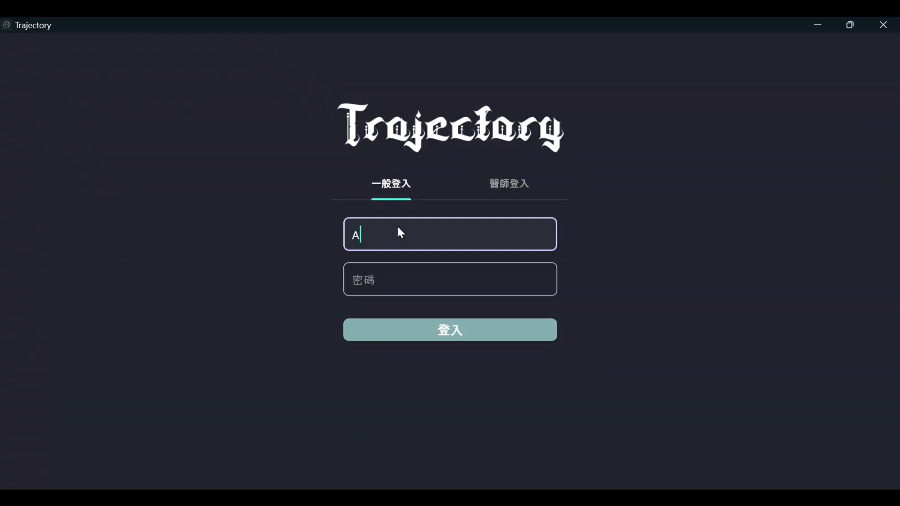
> 圖4. 登入介面

圖4頁面提供兩種登入方式：受試者由 「一般登入」通道登入，而管理者則由 「醫師登入」通道登入。

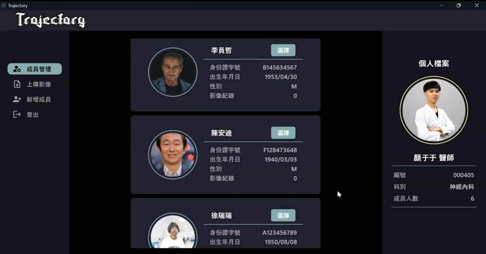
> 圖5. 醫師介面—成員管理

圖5頁面提供管理者一個列表，能查看所以有受試者，點選「選擇」按鈕跳轉至該受試者介面，調閱其腦部分析結果及歷次影像記錄。

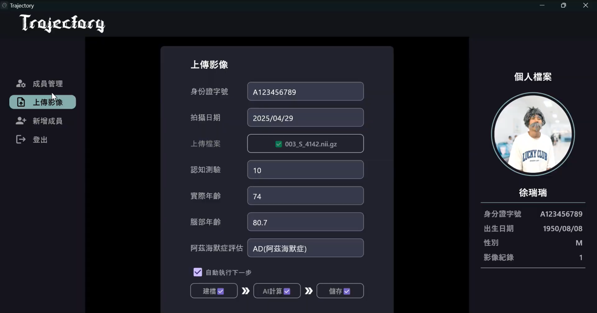
> 圖6. 醫師介面—上傳影像

圖6頁面提供資訊室人員圖形化介面上傳檢測資料，上傳過程分為三步驟：

1. 依序填入身分證字號、拍攝日期、腦部MRI影像與認知測驗結果（中低年齡群體不需要填寫此欄位），點擊「建檔」，資料將傳遞至伺服器並在資料庫中初始化一筆影像紀錄，並自動填寫實際年齡。
2. 點擊「AI計算」，伺服器將根據資料庫中的資料運行腦齡預測模型與失智症診斷模型（若未填入認知測驗結果，則不會運行失智症診斷模型），運算結束後將結果自動填入相對應欄位中。
3. 點擊「儲存」，將預測結果更新置資料庫。

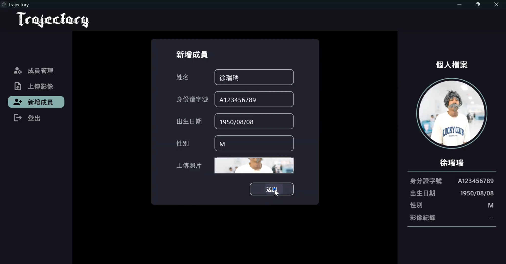
> 圖7. 醫師介面—新增成員

圖7頁面提供管理者新增受試者的圖形化介面，依序填入姓名、身分證字號、出生日期、性別與個人照，點擊「送出」，便可快速建立一般使用者帳號。

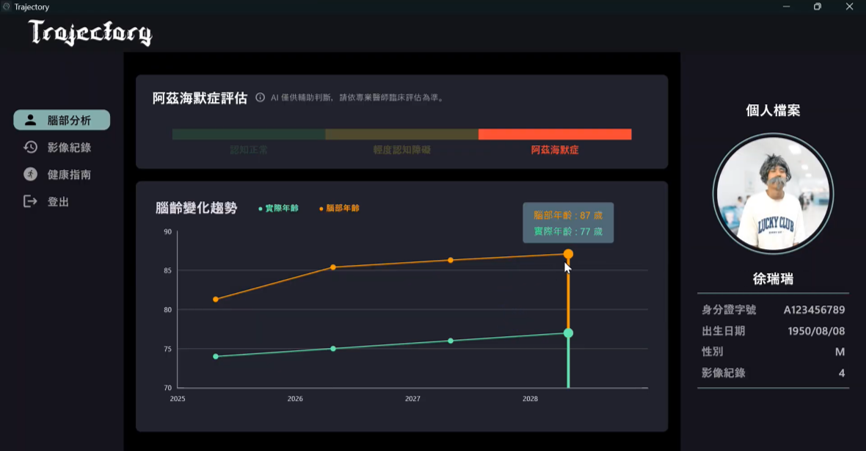
> 圖8. 一般使用者介面—腦部分析

圖8頁面提供受試者（及管理者）查閱腦部分析結果，上方的窗格顯示最近一次AI失智症診斷結果，若未曾檢測則不顯示結果；下方的窗格則顯示歷次檢測的實際年齡與腦齡折線圖，受試者能直觀看見腦部發展軌跡。

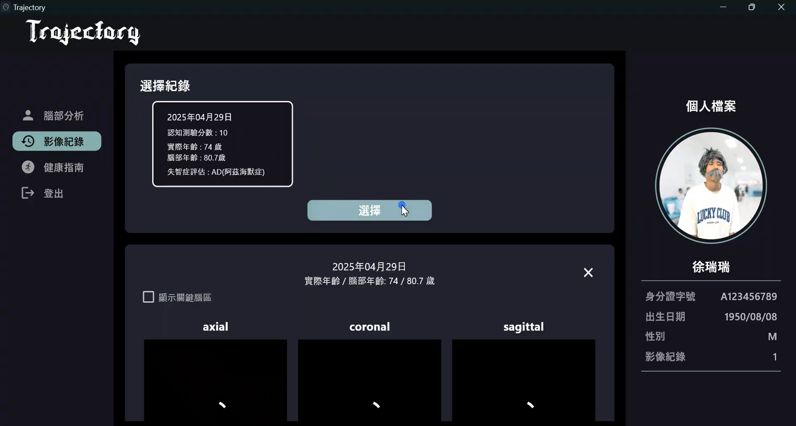
> 圖9(a).一般使用者介面—影像紀錄

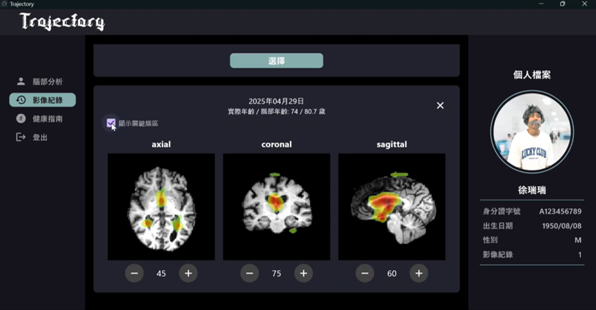
> 圖9(b). 一般使用者介面—影像紀錄

圖9頁面提供受試者（及管理者）查閱腦歷次影像紀錄細節，從上方的窗格（圖9(a)）可以選取欲查看的影像紀錄，點擊「選取」，則會在下方（圖9(b)）顯示該次MRI影像（可同時開啟多筆影像紀錄），使用者透果滑鼠滾輪可以檢視各方向腦部細節，勾選「顯示關鍵腦區」功能，MRI影像上會顯示其關鍵腦區熱圖輔助判讀。

---

## 🧑‍🌾 開發團隊

| 成員     | 貢獻度 | 負責工作 |
| -------- |-------| -------- |
| 顏少于   | 42% | 主持專案、前端設計與實作、系統整合 |
| 王冠智   | 33% | 後端API及資料庫設計與實作、產品文件製作 |
| 徐睿淳   | 25% | 系統發想、AI Pipeline、產品圖片及影片製作   |

> 💬 註：腦年齡預測模型與失智症分類模型皆為實驗室各自專題成果
> **失智症模型技術支援**： 劉學諺

---

## 🥇 獲獎

- **主辦單位**：[台灣作業研究學會](http://www.orstw.org.tw/)

- **比賽名稱**：台灣作業研究學會 大專生專題競賽

- **名次**：決策支援系統與應用組 第一名

合影成員 **(由左至右)**：顏少于、徐睿淳、王冠智、成功大學王逸琳教授

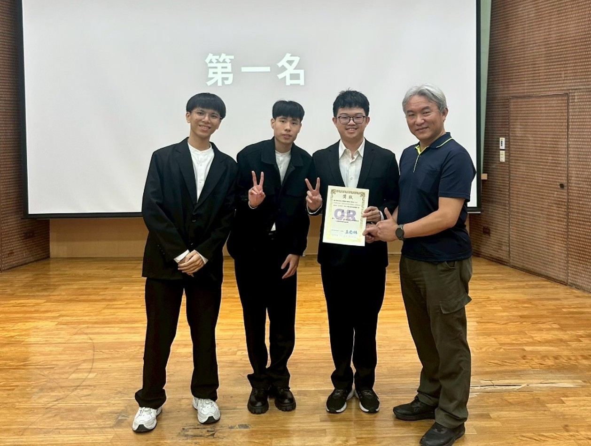

> 圖10. 團隊成員與學會理事長合影

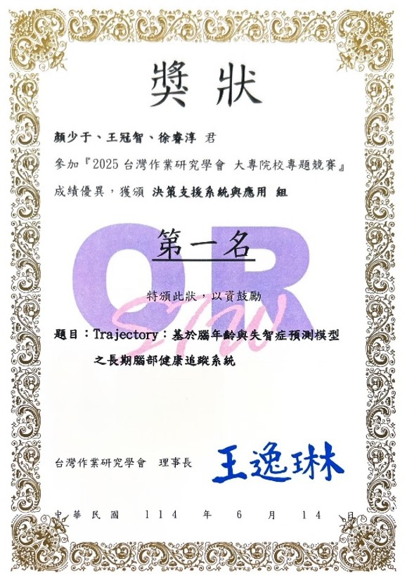
> 圖11. 參賽獎狀

---
